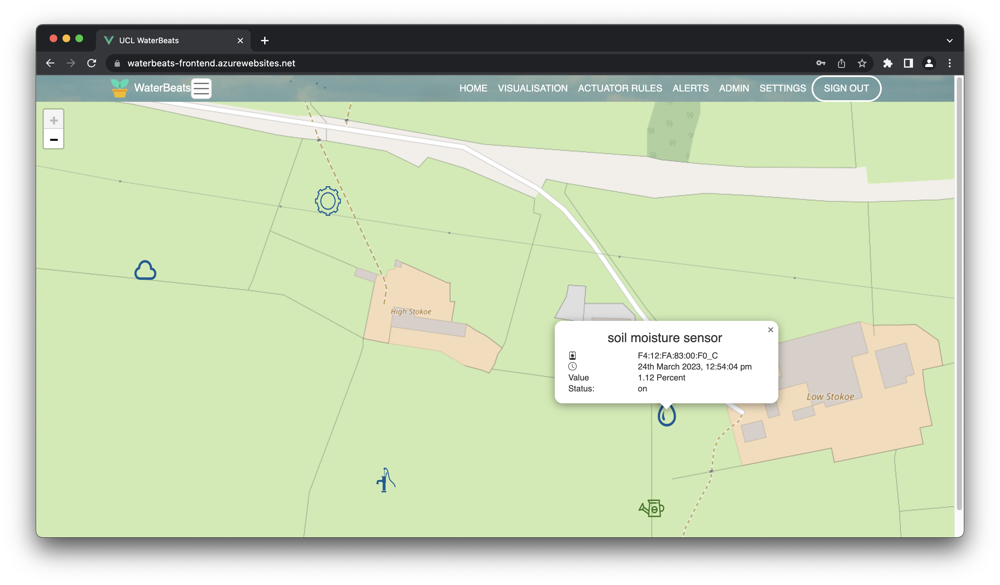

# WaterBeats
WaterBeats is a self-contained solution for data-driven farming. It is designed to be highly scalable, reliable, and usable without advanced knowledge.
It has its own data and rule processing engine connected to a multi-featured web interface without relying on Azure or FarmBeats API.

Our product WaterBeats uses two main components: Main Hub and Base Station. \
You can find links to component and sub-components including their documentation in the list below.

## Components
- [Base Station](./BaseStation)
- [Web Interface Front-end](./front-end)
- [Backend Service Database](./TSDB)
- [Authentication Gateway](./AuthGateway)

## Features
- Interactive map device view
- Graph-based sensor data visualisation
- Mobile alert system
- Automation rule system
- Storage of sensor data and rules
- Real IoT device hardware connections

## Web Interface Showcase
Alert Configuration

Rule Configuration

Device Map View

User Settings

Admin Settings

Login Screen

